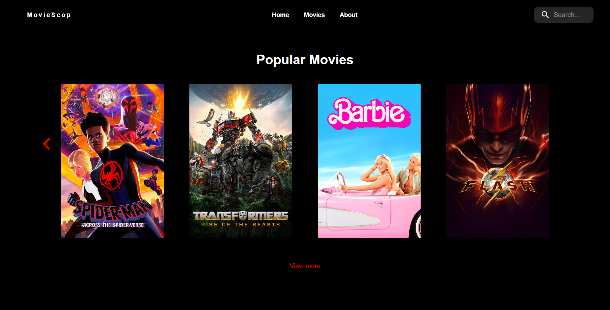

# Project Title

MovieScop

## Project Description

React Application to search for any movie

## Table of Contents

- [Installation](#installation)
- [Usage](#usage)
- [URL](#url)
- [Technologies](#technologies)
- [Development](#development)
- [Author](#author)

## Installation

1- Clone the repository:
git clone

2- Navigate to project directory:
cd MovieScope

3- Install dependencies:
npm install

4- Run the project:
npm run dev

## Usage

## url

Live Site URL: (https://moviescope-chi.vercel.app)

## Technologies

- React 18 & Vite
- TypeScript
- Matrial ui
- REST API
- Emotion
- CSS3
- NPM Libraries

## Development

Upcoming featuers:

- Support series
- Improve UI (animation)
- Improve Performance
- Add search filter
- Add recommendations
- Add related movies
- Account, wishlist, comment, leave raiting

## author

- LinkedIn - [@abdulrazzakalsssouki](https://www.linkedin.com/in/abdulrazzakalsssouki)
